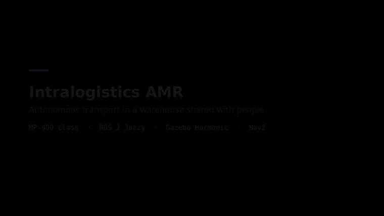

# Intralogistics AMR

[](https://github.com/MKamel7/intralogistics-amr/actions)
[](https://docs.ros.org)
[](https://navigation.ros.org)
[](LICENSE)


An autonomous mobile robot for indoor intralogistics, on ROS 2 Jazzy, Gazebo Harmonic and Nav2.
It moves load carriers between stations in a warehouse shared with people on foot, with a safety
layer that sits after the planner and can override it.

**One robot, not a fleet.** The repository was originally named for a multi-robot system and the
name outran the code; there is no traffic controller and no task allocation. A fleet layer is
cancelled, not deferred, and is claimed nowhere in this repository.

**Status: FINISHED. One platform validated end to end, with 67 recorded findings.** This README documents
what exists and what is measured, not what is planned. Every figure below is traceable to an entry
in `docs/validation.md`; anything not built is under Roadmap and is claimed nowhere else.

**A 52 second demo is at [docs/media/demo.mp4](docs/media/demo.mp4)**, showing the survey building
its own map, Nav2 planning a goal across the finished one, a transport cycle carrying the rated
load, and the vehicle passing a worker at 0.64 m without stopping. **It plays at true speed**, and
the timing is measured rather than assumed. It does not show docking, because docking does not work.

**If you have five minutes, read [docs/findings.md](docs/findings.md) instead of this file.** It is
the nine faults worth knowing about, each with the number attached and the wrong explanation that
held for a while. Two of them are claims this project made and later retracted, five of the faults
were in the measuring instruments rather than in the robot, and one was a value written, committed,
regenerated per platform and never read.



*The first 20 seconds of the demo: the survey building its own map, then Nav2 planning a goal
across it. The transport cycle and the pass by a worker follow in the full video.*

## 🛠️ Built with

| | |
| --- | --- |
| **Robotics** | ROS 2 Jazzy, Nav2 |
| **Simulation** | Gazebo Harmonic |
| **Interfaces** | VDA 5050 vehicle side |
| **Platforms** | MP-400 class, MiR250 configuration generated and tested |
| **Engineering** | Safety layer downstream of the planner, GitHub Actions CI |

## 🏗️ Architecture in five lines

- **Sensors.** Two 275 degree safety scanners at diagonally opposite corners, two RGB-D cameras,
  wheel odometry and an IMU, every one of them generated from the platform specification.
- **Perception.** The two scans are merged through TF into a single 360 degree view in `base_link`,
  and legs, heights and tracks are found in it (C++).
- **Localisation and Nav2.** `slam_toolbox` on the merged scan produces the 5 cm grid and
  `map -> odom`; Nav2 on SmacPlanner2D plans and drives the transport missions.
- **Safety supervisor.** Speed-switched protective and warning fields on `nav2_collision_monitor`,
  generated from the vehicle's own stopping distance, sitting between the velocity command and the
  wheels, consuming the merged scan and never a classifier.
- **ros2_control.** Differential drive over `gz_ros2_control`, with the controllers spawned when the
  model exists in the world rather than on a timer.

## 📊 Headline results

On the generated track, MP-400 class.

| | result | where |
|---|---|---|
| transport cycles | **12 of 12** across the four usable runs of five | V-44 |
| cycle time | 223 s [175 to 272], sd 24, n=12 | V-44 |
| contacts the vehicle drove into | **0** in 248 000 samples across two arms | V-51 |
| deepest a person reached inside the footprint | **-0.100 m**, against -0.466 m before V-39 was closed | V-49 |
| localisation error | p50 0.027 m driving, 0.055 m parked | V-37 |
| sensor to command latency | p50 84 ms, **p95 124 ms**, n=397, against a 0.10 s estimate | V-56 |
| the latency tail | **retracted**: it was a probe pairing artifact, not the stack | V-56 |
| braking distance, laden and unladen | **9 mm** median both, 95 and 102 mm worst, n=859 | V-60 |
| an unsecured 100 kg load, over a duty cycle | **0.0 mm** of slide, **3.8 deg** of rotation, none lost | V-61 |
| parked accuracy at a station | median **117 mm**, worst 212 mm against a 200 mm tolerance | V-62 |
| dock detection, gated | p95 **49.3 mm** while moving, **0** of 2784 beyond 300 mm | V-67 |

The other nine measurements, the planner comparison over nine runs, and the latency retraction
that cost this project a published claim are in
[docs/ENGINEERING_REPORT.md](docs/ENGINEERING_REPORT.md). Every figure traces to a numbered entry
in [docs/validation.md](docs/validation.md).

## 🎯 Why this exists

The claim this repository is built around:

> Every physical constant is traceable to a source, the protective envelope is generated from the
> vehicle specification rather than tuned, and the build fails when either stops being true.

That is enforced, not aspirational. `test_platform_spec.py` fails the build when a value loses its
provenance, and it has caught a real fault: a scanner mounting position quoted to the millimetre
from an operating manual that described a different sensor than the one fitted. See V-23.

### One quaternion to yaw, and one name per topic

`amr_common` exists because the same two mistakes kept being made. Quaternion to
yaw was written **twelve times across ten files, in two forms that are not the
same function**: the general one, and `2 * atan2(z, w)`, which is exact when
roll or pitch is zero and wrong when both are. Measured on a compound tilt of
30 degrees roll and 20 of pitch, the shortcut reports 34.59 degrees where the
heading is 40.00. Both sites using it read poses that are planar in today's
scenarios, which is a property of the scenarios and not of the code.

The topic names had the sharper failure mode. `diff_drive_controller` appeared
in seven Python files and in the controller and collision monitor YAML, and **a
subscriber to a renamed topic does not error, it goes quiet**, so renaming the
controller would have left those nodes running and receiving nothing.

Three checks keep it extracted, each verified by falsification rather than by
watching it pass: the YAML configs are checked against the constants in both
directions, and a grep gate fails the build if either yaw form is written
again, naming the file. The tests deliberately keep their own topic literals,
because a test that repeats the name independently is a check on the constant
rather than a copy of it.

## 📖 Where to read next

| | |
|---|---|
| [docs/findings.md](docs/findings.md) | **start here.** The nine faults worth knowing about, five minutes |
| [docs/ENGINEERING_REPORT.md](docs/ENGINEERING_REPORT.md) | every measurement, every subsystem, the instruments, the ADRs |
| [docs/validation.md](docs/validation.md) | the laboratory notebook, 67 numbered entries |
| [docs/safety_concept.md](docs/safety_concept.md) | the protective field reasoning and what it does not prove |
| [docs/adr](docs/adr) | ten architecture decision records |
| [docs/architecture](docs/architecture) | arc42 outline only; the decisions themselves are in the ADRs |

## 🚚 The robot

Two platform classes share one sensor set: two safety laser scanners at diagonally opposite corners
and two 3D cameras on a differential drive with casters. Every result above is on the **MP-400
class** (590 x 559 mm, 100 kg rated payload, from the Neobotix operating manual). The **MiR250
class** (250 kg payload) was the original reference and is still generated and tested, but has not
been run on the track since. Each is a class of machine derived from a published specification,
with its own livery. Neither is a model of any vendor's product, carries vendor branding, or is
presented as equivalent to one, and the reasoning behind the class approach is in
[ADR 0002](docs/adr/0002-mir250-class-reference-platform.md). Data sheets are archived in
[`docs/datasheets/`](docs/datasheets/) with text extractions beside them, so every constant cites a
line rather than a memory.

## 📁 Layout

```
src/amr_description   platform specs, xacro description, generated controllers
    amr_perception    scan merge, leg and height detection, tracking (C++)
    amr_navigation    Nav2 configuration generator, survey runner, keepout masks
    amr_safety        protective field generator, collision monitor configuration
    amr_sim           world generator, pedestrian driver, ground truth oracle
    amr_mission       transport task, station definitions
    amr_bringup       launch
    amr_evaluation    scoring tools and the experiment runner
    amr_vda5050       VDA 5050 vehicle interface over MQTT
    amr_common        one quaternion to yaw, and one name per topic
tools/                the instruments: nine probes, the stack runner, teardown
docs/findings.md      START HERE: the nine worth reading, with the numbers
docs/ENGINEERING_REPORT.md  every measurement, every subsystem, the instruments
docs/validation.md    the laboratory notebook, 67 numbered entries
docs/adr              architecture decision records
docs/architecture     arc42 outline; the decisions are in docs/adr
docs/datasheets       archived source documents for every physical constant
requirements/         requirements with IDs, traced to tests
Dockerfile            builds from a clean base and runs the suite
```

## ▶️ Try it

```
./demo.sh
```

Builds if needed, brings the stack up, surveys the generated track, runs two transport cycles on
the MP-400 class platform with the cameras off, and prints the result table the transport task
produces. The script's own estimate is about fourteen minutes, most of it the survey that builds
the map first. Nothing needs clicking.

`tools/run_stack.sh --help` is the real instrument behind it: platform
selection, the two worlds, survey and mission tasks, and the preflight gate that
refuses to measure an unhealthy stack.

## 🔨 Build

```bash
git clone https://github.com/MKamel7/intralogistics-amr.git
cd intralogistics-amr
colcon build --symlink-install
source install/setup.bash
colcon test && colcon test-result
```

Tests that need no ROS at all are the generator and provenance gates CI runs first, listed in
`.github/workflows/ci.yml` (`python3 -m pytest -q src/amr_description/test/test_platform_spec.py
src/amr_safety/test/test_fields.py ...`); the rest of `src/amr_description/test` needs `xacro`. What `colcon test`
must never report is FEWER pytest cases than `pytest src`, and for most of this project's life it
did; `test_registration.py` now fails the build if a test file exists that the build does not run.
See V-50.

## 💡 What I learned

- **A safety layer belongs after the planner, not inside it.** If safety is a
  constraint the planner respects, it can be planned around. Putting it downstream,
  where it can override a plan that was legal when it was made, is the difference
  between a robot that is safe and one that intended to be.

- **Most of autonomy turns out to be bookkeeping.** The navigation was the interesting
  part for about a week. What actually decided whether the thing worked was task state,
  recovery after a failed leg, and knowing which carrier is where.

- **Integration is the project, not the last step.** ROS 2, Gazebo, Nav2 and the task
  layer each work. Getting them to agree about time, frames and lifecycle is where the
  weeks went, and nobody writes that in a tutorial.

- **A shared floor changes the problem.** Planning among static obstacles is a solved
  exercise. Planning in a warehouse shared with people on foot is a different question,
  and it is the reason the safety layer exists at all.

## 🔭 Future improvements

Capability-level, and the measurement-level list a successor would work from is in the engineering
report.

- **Wire the dock approach controller into a mission and measure a parked accuracy at the dock.**
  The fiducial work this used to call for is not justified: V-67 measured the existing geometric
  detector at 49.3 mm p95 while moving with zero false positives, which is inside the budget a
  marker would have been added to reach. What is unmeasured is parking BY that sensor, against the
  117 mm median a map-frame goal achieves.
- **Run VDA 5050 against a real broker.** The bridge has its own launch file and refuses to connect
  without credentials and TLS, but its tests run without a broker, nothing in the main bringup starts
  it, and no entry in `docs/validation.md` has driven the vehicle through it.
- **Bring the launch files and the RViz generator onto `amr_common.topics`.** The nodes and probes
  use it now; `navigation.launch.py` and `build_navigation_rviz.py` still carry topic literals,
  because a launch file that imports from the workspace it is launching is a dependency worth
  thinking about rather than a rename.

- **Handle the load with a mechanism.** With `--physical-load` the box rides on the deck held by
  friction alone (V-61), but it is placed there and set down on the table by the simulator, not by
  a lift or a fork. The vehicle has no lifting mechanism and none is claimed.
- **Measure the human-aware costmap layer in missions.** The proxemic layer is on by default and
  cut time in a person's intimate space from 7.33 % to 5.00 % on a matched survey (V-64). That is
  one task type; it has not been measured across transport missions.
- **Validate the MiR250 on the track.** Its specification and generated configuration are kept and
  the tests run over both platforms, which is what caught V-33, but it has never been run on the
  track as a vehicle.
- **The fleet layer, still deliberately absent.** No dispatcher, no lane reservation, no task
  allocation. The VDA 5050 interface is the vehicle half, and a dispatcher with one robot behind it
  would be a claim without a measurement. It stays out until there is a second robot to measure.

## 🕓 Predecessor

This project began as a rebuild of a university coursework project
([`warehouse-fleet`](https://github.com/MKamel7/warehouse-fleet), SoSe 2026), which is preserved as
submitted. Almost nothing carries over: different simulator, different ROS distribution, different
robot, different architecture. This repository is solo work from its first commit.

## 📄 Licence

Apache-2.0. The imported warehouse scenery is derived from the AWS RoboMaker small warehouse world,
copyright Amazon.com, Inc., licensed MIT-0; see `src/amr_sim/models/README.md`.

---

Built by **Mo Kamel**, M.Eng. student in Mechatronic and Cyber-Physical Systems, Technische
Hochschule Deggendorf.
[Portfolio](https://mkamel7.github.io) · [LinkedIn](https://linkedin.com/in/mo-kamel7)
